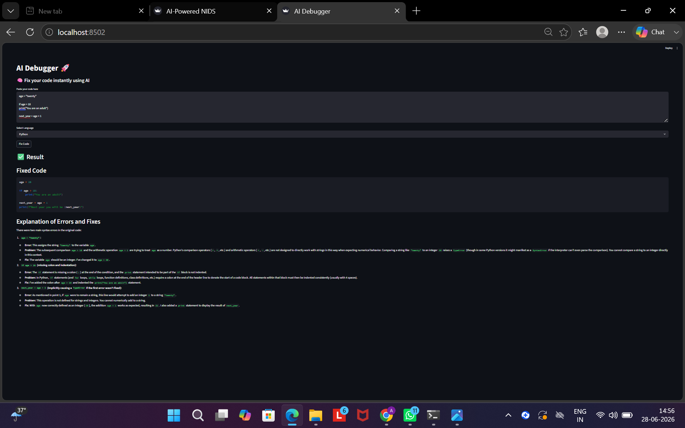

# Autonomous AI Code Debugger

An AI-powered debugging tool that automatically detects, analyzes, and fixes code errors across multiple programming languages in real time — built with Python, Streamlit, and LLM APIs via OpenRouter.

> Built by Aparna Kumari · BTech CSE, Vishwakarma University

---

## Demo

<!-- Add your Streamlit dashboard screenshot here -->


---

## Features

- Automatic error detection across Python, Java, and C++
- AI-powered code fixing with detailed explanations
- Context-aware prompt engineering for language-specific fixes
- Real-time response (avg. < 2 seconds)
- Clean, interactive Streamlit UI
- Modular architecture for easy extension

---

## Performance

| Metric | Result |
|---|---|
| Debugging time reduction | 60–70% |
| Supported languages | Python, Java, C++ |
| Avg. response time | < 2 seconds |
| Requests per session | 100+ |

---

## Architecture

```
User Input (code + language selection)
       │
       ▼
app.py  ──────────────────────────────────────┐
       │                                       │
       ▼                                       ▼
analyzer.py                              Streamlit UI
(error detection)                   (real-time input/output)
       │
       ▼
fixer.py
(prompt engineering + OpenRouter API call)
       │
       ▼
executor.py
(response parsing + fix extraction)
       │
       ▼
Fixed Code + Explanation → displayed in UI
```

---

## Tech Stack

| Layer | Tools |
|---|---|
| Frontend | Streamlit |
| Backend | Python |
| LLM Integration | OpenRouter API |
| Prompt Engineering | Custom context-aware prompts |
| Dev Tools | Git, VS Code |

---

## Project Structure

```
Autonomous-AI-Code-Debugger/
├── app.py          # Streamlit UI and main entry point
├── analyzer.py     # Error detection logic
├── fixer.py        # Prompt engineering + LLM API calls
├── executor.py     # Response parsing and fix extraction
└── requirements.txt
```

---

## Setup & Usage

```bash
git clone https://github.com/Aparna0604/Autonomous-AI-Code-Debugger.git
cd Autonomous-AI-Code-Debugger
pip install -r requirements.txt
streamlit run app.py
```

You will need an [OpenRouter API key](https://openrouter.ai/). Add it to your environment or directly in `fixer.py`.

---

## How It Works

1. User pastes code and selects the language
2. `analyzer.py` detects the error type and context
3. `fixer.py` constructs a language-specific prompt and calls the LLM via OpenRouter
4. `executor.py` parses the response and extracts the fixed code + explanation
5. Result is displayed in the Streamlit UI in real time

---

## License 

MIT
